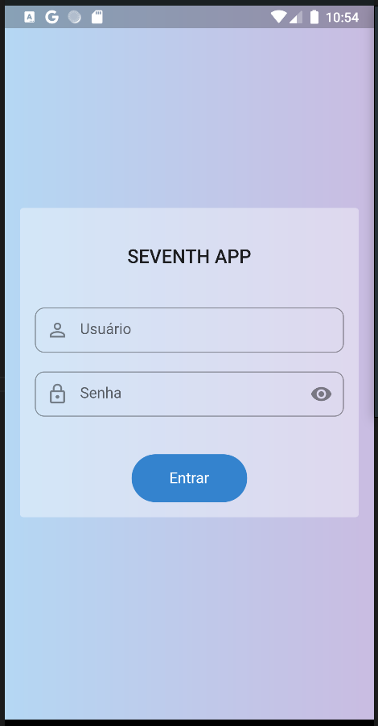
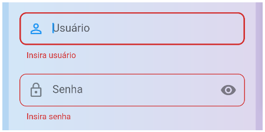
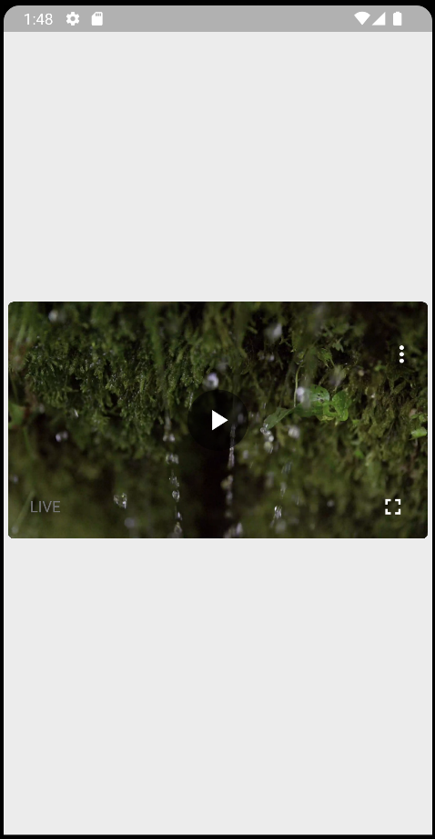

# **Seventh App**

Um aplicativo que exibe um video da internet.

## Sobre o projeto

Este projeto se trata de um aplicativo que realiza a transmissão de um video obtido via API, mas que antes é feita autenticação do usuário nesta mesma API. Após o login, é obtido um token de acesso único, que é usado para buscar esse video.

> Documentação da API: http://mobiletest.seventh.com.br/api-docs/#/

 

## **Fluxo de interação:**
----

 

 ###  **| 1. Login**

 

Na tela de login o usuário precisa informar o username de acesso, e a senha. 

Usuário para testes:

>	usuário: **candidato-seventh**

>	senha: **8n5zSrYq**

 

Caso o usuário clique no botão ‘Entrar’ sem preencher algum dos campos é exibido uma informação de erro nos referentes campos.

 

Ao informar os dados e clicar em ‘Entrar’, se tiver algo de errado, será exibido uma mensagem com o erro por meio de um SnackBar,

e caso haja sucesso, é redirecionado para homepage.

 

 

 

### **| 2. Home**

 

Nesta página é exibido com o video transmitido em destaque, com um player que possui as funções de **play, pause e fullscreen,** para colocar o video em tela cheia. 

 

Aqui temos o player com o video em tela cheia.

 

 

 

## **Informações técnicas:**
----

 

- Flutter Version: 3.3.4
- Dart Version: 2.18.2
- IDE utilizada: VS Code
- SO: Zorin OS (based on Ubuntu)
- Testes realizados em: emulador Android 8.1.0 (API 27) e emulador Android 8.1.0 (API 31)

 

Como arquitetura do projeto foi aplicado o MVC e o Clean Archicteture (de uma forma mais simplificada), devido ao tamanho do projeto, mas buscando um baixo acoplamento do código, com camadas bem definidas e classes objetivas, e utilizando tambem de interfaces (classes abstratas) conforme as boas práticas de desenvolvimento, facilitando reuso, testes, e manutenção. Para controle de estado foi utilizado as opções nativas, se são bem otimizadas, contribuem para a performace, manutenção e legibilidade, sendo assim a melhor opção para este projeto. Para injeção de dependencias foi usado uma dependencia, que é simples e funciona muito bem para o projeto, não afetando a perfomance.

